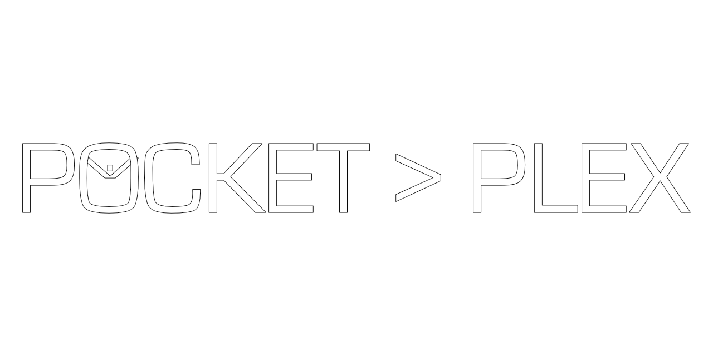

<p align="center"></p>

# PocketPlex

A lightweight, text-first Plex client for Linux retro handhelds. It streams from your own Plex Media Server (PMS) over home Wi-Fi: the server transcodes everything to a small 480p H.264 stream, and the handheld shows a text menu and plays it with mpv.

- **Primary target:** Anbernic RG35XX SP on Knulli (verified, v1 complete)
- **Secondary target:** Miyoo Mini Plus on Onion (music-first; not yet tested on the device)
- Not affiliated with Plex Inc.

**Status:** v1 works on the RG35XX SP: PIN login, server choice, browsing Movies and TV, playback with resume, and watch-progress sync with Plex. Music mode and the Mini Plus are next. See [Status and roadmap](#status-and-roadmap).

---

## Requirements

- A Plex Media Server on your home network, with enough CPU to transcode (or hardware transcoding). Plex Pass isn't needed.
- On the server: **Settings → Network → Secure connections = "Preferred"** (not "Required").
- An RG35XX SP running **Knulli** with Wi-Fi set up. It uses the system SDL2, SDL2_ttf, libcurl and mpv, which Knulli already ships.

## Install on the RG35XX SP (Knulli)

1. Get `pocketplex-sp.zip`: either the `pocketplex-sp-zip` artifact from the latest green GitHub Actions run, or build it yourself (see [Building](#building)).
2. Copy the zip's contents to `/userdata/roms/ports/` on the SD card (or over SSH), so you have:
   ```
   /userdata/roms/ports/PocketPlex.sh
   /userdata/roms/ports/pocketplex/   (PocketPlex binary, assets/, port.json, ...)
   ```
3. In EmulationStation, refresh the list once: **Start → Game Settings → Update Gamelists**. **PocketPlex** then shows up under **Ports**.

To update later, copy the new zip over the old files. Your `pocketplex/pocketplex.ini` (login and settings) is kept, because the zip doesn't contain one.

## First run

1. Open **Ports → PocketPlex**. The **Link** screen shows a 4-character code.
2. On your phone, go to **plex.tv/link** and enter the code. The handheld saves its own login to `pocketplex/pocketplex.ini`.
3. Pick your server from the list (shown by name). The choice is saved, so later launches open straight on **Home**.

## Using it

**Home** shows Continue Watching and your libraries. Browse Library → Show → Season → Episode (or Movies → Movie), and press A on an item to open its **Detail** screen. If you've watched part of it, A offers **Resume** or **Play from start** (Up/Down to choose).

| Button | Menus | During playback |
|---|---|---|
| D-pad Up / Down | Move | Seek +5 / −5 min |
| D-pad Left / Right | — | Seek −10 / +10 s |
| A | Select / Play | Pause / resume |
| B | Back one level | Stop and return to Detail |
| L1 / R1 | Page up / down (on Home, L1 = server list) | Seek −60 / +60 s |
| X | — | Show progress |
| Start | Go to Home | Pause / resume |
| Select | Settings | Show progress |
| Menu | Back; on Home it quits | Stop |

The A/B/X/Y buttons follow the labels printed on the SP. If they seem swapped on another device, use **Settings → Swap A/B**.

**Settings** (Select):
- **Video Quality:** 480p (default, ~1.5 Mbps) or 360p (~0.8 Mbps, for weaker Wi-Fi).
- **Subtitles:** on (default) burns in the subtitle track you've selected for that item in Plex; off sends none.
- **Swap A/B:** swaps confirm and back if your device's layout differs.
- **Sign Out:** clears the saved login, so the next launch shows the Link screen.

Progress is reported to your server while you watch and when you stop, so Plex (and Continue Watching) resume where you left off.

## Troubleshooting

- **PocketPlex isn't in Ports:** run **Update Gamelists** in EmulationStation.
- **Can't reach the server / errors after waking the device:** sleep drops Wi-Fi. Wait for it to reconnect, then go back and retry.
- **Low quality or stutter:** check Settings → Video Quality, and that your server can transcode in real time.
- **Logs:** `/userdata/roms/ports/pocketplex/log.txt` (screen changes, button presses, playback). Tokens are redacted.
- The line `/usr/lib64/libcurl.so.4: no version information available` at startup is harmless.

## Configuration file

`pocketplex/pocketplex.ini` (next to the binary; the launcher points `POCKETPLEX_INI` at it). Normally the app writes it for you. Keys: `[plex] server_url, token, client_id` and `[ui] quality = 480p|360p, subtitles = burn|off, swap_ab = true|false`. See `pocketplex.ini.example`. **It contains your Plex token: don't share it or commit it** (it's gitignored).

---

## Building

Desktop (macOS/Linux, needs SDL2, SDL2_ttf and libcurl, e.g. `brew install sdl2 sdl2_ttf`):

```bash
make                 # app + tools for PLATFORM=desktop → build/pocketplex, build/pp-cli
make test            # unit tests (no network)
make run             # run the desktop app (keyboard: arrows, Enter=A, Backspace=B, a/z/x, PgUp/PgDn=L1/R1, s=Start, p=Select, Esc=Menu)
```

Device packages are cross-compiled in Docker (Docker Desktop or OrbStack must be running; only needed for these two targets):

```bash
make docker-sp       # → dist/pocketplex-sp.zip   (aarch64, RG35XX SP / Knulli)
make docker-mmp      # → dist/pocketplex-mmp.zip  (armhf, Miyoo Mini Plus / Onion; untested on the device)
```

CI (`.github/workflows/build.yml`) builds desktop, SP and MMP on every push and uploads the zips as artifacts.

**Developer tools:**
- `build/pp-cli`: headless client for the real server. `login | servers | ls [key] | ondeck | url <rk> | stop <session> | progress <rk> <ms> | watched <rk>`. It uses `pocketplex.ini` (or `POCKETPLEX_INI`).
- App smoke modes: `--smoke-scroll`, `--smoke-walk` (real server, Library → Episode and back), `--smoke-link` (fake data), `--smoke-play <ratingKey> [--play-seconds N]`, `--exit-after-ms N`.

Merge gate: 0 warnings in `make`, `make test` **and** `make docker-sp` (GCC catches warnings macOS clang doesn't).

## Status and roadmap

- **Done (v1, verified on the RG35XX SP):** PIN login, server discovery with friendly names, Movies/TV browsing, transcoded playback (640×480 profile, 0 dropped frames over 10 min), pause/seek/exit from buttons, resume and watch-progress sync, subtitles on/off, Nintendo-layout buttons.
- **Next (Phase 3):** music mode (Artist → Album → Track, now-playing); Miyoo Mini Plus feasibility spike.
- **Later:** poster thumbnails, on-screen keyboard search, Plex Home users.
- Known follow-ups: [`docs/BACKLOG.md`](docs/BACKLOG.md).

## Project docs

- [`docs/devices.md`](docs/devices.md): measured RG35XX SP findings (player, buttons, display hand-off, soak results).
- [`docs/BACKLOG.md`](docs/BACKLOG.md): minor findings not yet fixed.
